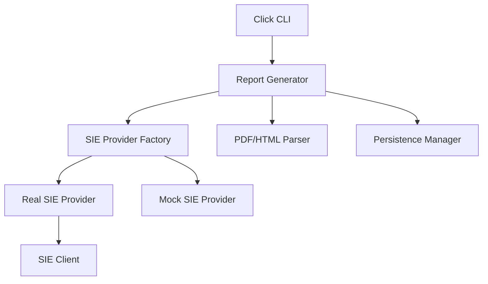

# Architecture Overview: inflacional

Technical documentation detailing the system design, components, and data flows.

## Table of Contents

1. [Introduction](#introduction)
2. [Architecture Principles](#architecture-principles)
3. [System Components](#system-components)
4. [Data Flow](#data-flow)
5. [Decision History (ADRs)](#decision-history-adrs)

## Introduction

**inflacional** is a Python-based tool for generating inflation reports using the Banxico SIE API.

## Data Source

The system relies exclusively on the **[Banxico SIE REST API v1](https://www.banxico.org.mx/SieAPIRest/service/v1/)**. All integration logic must strictly adhere to this official documentation, particularly regarding authentication headers (`Bmx-Token`) and data schemas.

## Architecture Principles

See [.specify/memory/constitution.md](file:///c:/Users/USER/OneDrive/Documentos/Projects/inflacional/.specify/memory/constitution.md) for core principles.

- **Security & Privacy First**
- **Quality through BDD**
- **Strict API Compliance**
- **CLI-First**
- **Comprehensive Documentation**

## System Components

## Data Flow

1. USER triggers `generate` command via CLI.
2. `ReportGenerator` fetches data from `SIEClient`.
3. Indices are parsed and processed.
4. Report is generated and saved via `PersistenceManager`.

## Decision History (ADRs)

Traced decisions can be found in [doc/design/adr/](file:///c:/Users/USER/OneDrive/Documentos/Projects/inflacional/doc/design/adr/).

- [ADR 0001: API Mocking and Environment Separation](file:///c:/Users/USER/OneDrive/Documentos/Projects/inflacional/doc/design/adr/0001-api-mock-separation.md)
- [ADR 0002: Documentation Standards and Processes](file:///c:/Users/USER/OneDrive/Documentos/Projects/inflacional/doc/design/adr/0002-documentation-standards.md)
- [ADR 0003: API Provider Abstraction](file:///c:/Users/USER/OneDrive/Documentos/Projects/inflacional/doc/design/adr/0003-api-provider-abstraction.md)
